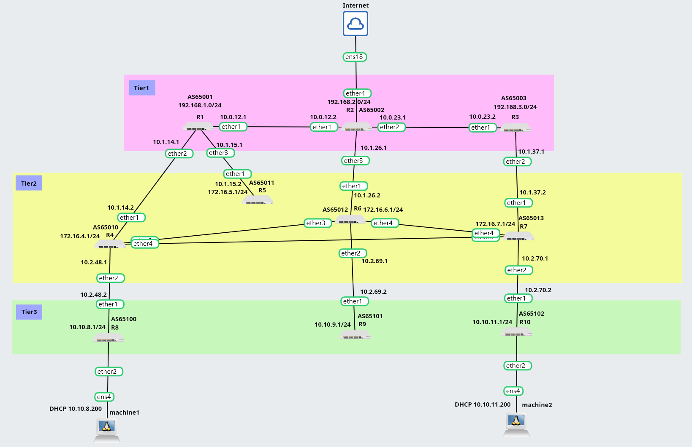

# BGP Lab Manual — MikroTik CHR + GNS3



## Topology

```
                          [Internet/Cloud]
                                |
                             ether4
                    +---------R2----------+
                    |      AS65002        |
                 ether1   192.168.2.0/24  ether2
                    |                     |
                 ether1                ether1
               R1(AS65001)           R3(AS65003)
            192.168.1.0/24         192.168.3.0/24
            ether2   ether3            ether2
               |        |                |
            ether1    ether1           ether1
         R4(AS65010) R5(AS65011)    R7(AS65013)
        172.16.4.0/24 172.16.5.0/24 172.16.7.0/24
        ether2 ether3 ether4        ether2 ether3 ether4
           |     \      \  \           |     |      |
        ether1    \      \  \       ether1   |      |
      R8(AS65100)  \      \  +---ether3-R6   |      |
      10.10.8.0/24  \      +------ether4-R6  |      |
        ether2       +----------ether3-R7----+      |
           |                  AS65012               |
        machine1            172.16.6.1/24        ether2
      DHCP:10.10.8.200       ether2             R10(AS65102)
                               |               10.10.11.0/24
                            ether1                ether2
                          R9(AS65101)               |
                          10.10.9.0/24           machine2
                                             DHCP:10.10.11.200
```

---

## Addressing

### Tier1 — inter-links
| Link    | Subnet       | R-left | R-right |
|---------|--------------|--------|---------|
| R1 — R2 | 10.0.12.0/30 | .1     | .2      |
| R2 — R3 | 10.0.23.0/30 | .1     | .2      |

### Tier1 — downlinks to Tier2
| Link    | Subnet       | Tier1 | Tier2 |
|---------|--------------|-------|-------|
| R1 — R4 | 10.1.14.0/30 | .1    | .2    |
| R1 — R5 | 10.1.15.0/30 | .1    | .2    |
| R2 — R6 | 10.1.26.0/30 | .1    | .2    |
| R3 — R7 | 10.1.37.0/30 | .1    | .2    |

### Tier2 — downlinks to Tier3
| Link     | Subnet       | Tier2 | Tier3 |
|----------|--------------|-------|-------|
| R4 — R8  | 10.2.48.0/30 | .1    | .2    |
| R6 — R9  | 10.2.69.0/30 | .1    | .2    |
| R7 — R10 | 10.2.70.0/30 | .1    | .2    |

### Tier2 — peering links
| Link    | Subnet       | R-left | R-right |
|---------|--------------|--------|---------|
| R4 — R6 | 10.3.46.0/30 | .1     | .2      |
| R4 — R7 | 10.3.47.0/30 | .1     | .2      |
| R6 — R7 | 10.3.67.0/30 | .1     | .2      |

### Loopbacks (announced prefixes)
| Router | AS    | Loopback        |
|--------|-------|-----------------|
| R1     | 65001 | 192.168.1.1/24  |
| R2     | 65002 | 192.168.2.1/24  |
| R3     | 65003 | 192.168.3.1/24  |
| R4     | 65010 | 172.16.4.1/24   |
| R5     | 65011 | 172.16.5.1/24   |
| R6     | 65012 | 172.16.6.1/24   |
| R7     | 65013 | 172.16.7.1/24   |
| R8     | 65100 | 10.10.8.1**/32** |
| R9     | 65101 | 10.10.9.1/24    |
| R10    | 65102 | 10.10.11.1**/32** |

> **Note:** R8 and R10 use /32 on loopback because their client subnet
> (10.10.8.0/24 and 10.10.11.0/24) is also assigned to ether2 for DHCP.
> Using /24 on loopback causes MikroTik to source replies from the loopback
> address instead of ether2, breaking connectivity to client machines.

---

## Router Configuration

> **Note:** On MikroTik CHR, loopback is created as a bridge with no ports.
> GNS3 numbers interfaces starting from 0, so the first physical port
> may be ether8 instead of ether1 depending on the image.
> Always verify with `/interface print` using MAC addresses.

---

### R1 (AS65001)

```routeros
/ip address add address=10.0.12.1/30 interface=ether1
/ip address add address=10.1.14.1/30 interface=ether2
/ip address add address=10.1.15.1/30 interface=ether3
/interface bridge add name=lo
/ip address add address=192.168.1.1/24 interface=lo
/routing bgp instance set default as=65001
/routing bgp peer add name=r2 remote-address=10.0.12.2 remote-as=65002
/routing bgp peer add name=r4 remote-address=10.1.14.2 remote-as=65010
/routing bgp peer add name=r5 remote-address=10.1.15.2 remote-as=65011
/routing bgp network add network=192.168.1.0/24
/routing bgp peer set r4 default-originate=always
/routing bgp peer set r5 default-originate=always
```

---

### R2 (AS65002)

```routeros
/ip address add address=10.0.12.2/30 interface=ether1
/ip address add address=10.0.23.1/30 interface=ether2
/ip address add address=10.1.26.1/30 interface=ether3
/interface bridge add name=lo
/ip address add address=192.168.2.1/24 interface=lo
/routing bgp instance set default as=65002
/routing bgp peer add name=r1 remote-address=10.0.12.1 remote-as=65001
/routing bgp peer add name=r3 remote-address=10.0.23.2 remote-as=65003
/routing bgp peer add name=r6 remote-address=10.1.26.2 remote-as=65012
/routing bgp network add network=192.168.2.0/24

# Internet uplink via Cloud node on ether4
/ip dhcp-client add interface=ether4 disabled=no
/ip firewall nat add chain=srcnat out-interface=ether4 action=masquerade
/routing bgp peer set r1 default-originate=always
/routing bgp peer set r3 default-originate=always
/routing bgp peer set r6 default-originate=always
```

---

### R3 (AS65003)

```routeros
/ip address add address=10.0.23.2/30 interface=ether1
/ip address add address=10.1.37.1/30 interface=ether2
/interface bridge add name=lo
/ip address add address=192.168.3.1/24 interface=lo
/routing bgp instance set default as=65003
/routing bgp peer add name=r2 remote-address=10.0.23.1 remote-as=65002
/routing bgp peer add name=r7 remote-address=10.1.37.2 remote-as=65013
/routing bgp network add network=192.168.3.0/24
/routing bgp peer set r7 default-originate=always
```

---

### R4 (AS65010)

```routeros
/ip address add address=10.1.14.2/30 interface=ether1
/ip address add address=10.2.48.1/30 interface=ether2
/ip address add address=10.3.46.1/30 interface=ether3
/ip address add address=10.3.47.1/30 interface=ether4
/interface bridge add name=lo
/ip address add address=172.16.4.1/24 interface=lo
/routing bgp instance set default as=65010
/routing bgp peer add name=r1 remote-address=10.1.14.1 remote-as=65001
/routing bgp peer add name=r8 remote-address=10.2.48.2 remote-as=65100
/routing bgp peer add name=r6 remote-address=10.3.46.2 remote-as=65012
/routing bgp peer add name=r7 remote-address=10.3.47.2 remote-as=65013
/routing bgp network add network=172.16.4.0/24
/routing bgp peer set r8 default-originate=always
```

---

### R5 (AS65011)

```routeros
/ip address add address=10.1.15.2/30 interface=ether1
/interface bridge add name=lo
/ip address add address=172.16.5.1/24 interface=lo
/routing bgp instance set default as=65011
/routing bgp peer add name=r1 remote-address=10.1.15.1 remote-as=65001
/routing bgp network add network=172.16.5.0/24
```

---

### R6 (AS65012)

```routeros
/ip address add address=10.1.26.2/30 interface=ether1
/ip address add address=10.2.69.1/30 interface=ether2
/ip address add address=10.3.46.2/30 interface=ether3
/ip address add address=10.3.67.1/30 interface=ether4
/interface bridge add name=lo
/ip address add address=172.16.6.1/24 interface=lo
/routing bgp instance set default as=65012
/routing bgp peer add name=r2 remote-address=10.1.26.1 remote-as=65002
/routing bgp peer add name=r9 remote-address=10.2.69.2 remote-as=65101
/routing bgp peer add name=r4 remote-address=10.3.46.1 remote-as=65010
/routing bgp peer add name=r7 remote-address=10.3.67.2 remote-as=65013
/routing bgp network add network=172.16.6.0/24
/routing bgp peer set r9 default-originate=always
```

---

### R7 (AS65013)

```routeros
/ip address add address=10.1.37.2/30 interface=ether1
/ip address add address=10.2.70.1/30 interface=ether2
/ip address add address=10.3.47.2/30 interface=ether3
/ip address add address=10.3.67.2/30 interface=ether4
/interface bridge add name=lo
/ip address add address=172.16.7.1/24 interface=lo
/routing bgp instance set default as=65013
/routing bgp peer add name=r3 remote-address=10.1.37.1 remote-as=65003
/routing bgp peer add name=r10 remote-address=10.2.70.2 remote-as=65102
/routing bgp peer add name=r4 remote-address=10.3.47.1 remote-as=65010
/routing bgp peer add name=r6 remote-address=10.3.67.1 remote-as=65012
/routing bgp network add network=172.16.7.0/24
/routing bgp peer set r10 default-originate=always
```

---

### R8 (AS65100)

```routeros
/ip address add address=10.2.48.2/30 interface=ether1
/ip address add address=10.10.8.254/24 interface=ether2
/interface bridge add name=lo
/ip address add address=10.10.8.1/32 interface=lo
/routing bgp instance set default as=65100
/routing bgp peer add name=r4 remote-address=10.2.48.1 remote-as=65010
/routing bgp network add network=10.10.8.0/24

# DHCP for machine1
/ip pool add name=pool-r8 ranges=10.10.8.100-10.10.8.200
/ip dhcp-server add name=dhcp-r8 interface=ether2 address-pool=pool-r8 disabled=no
/ip dhcp-server network add address=10.10.8.0/24 gateway=10.10.8.254
```

---

### R9 (AS65101)

```routeros
/ip address add address=10.2.69.2/30 interface=ether1
/interface bridge add name=lo
/ip address add address=10.10.9.1/24 interface=lo
/routing bgp instance set default as=65101
/routing bgp peer add name=r6 remote-address=10.2.69.1 remote-as=65012
/routing bgp network add network=10.10.9.0/24
```

---

### R10 (AS65102)

```routeros
/ip address add address=10.2.70.2/30 interface=ether1
/ip address add address=10.10.11.254/24 interface=ether2
/interface bridge add name=lo
/ip address add address=10.10.11.1/32 interface=lo
/routing bgp instance set default as=65102
/routing bgp peer add name=r7 remote-address=10.2.70.1 remote-as=65013
/routing bgp network add network=10.10.11.0/24

# DHCP for machine2
/ip pool add name=pool-r10 ranges=10.10.11.100-10.10.11.200
/ip dhcp-server add name=dhcp-r10 interface=ether2 address-pool=pool-r10 disabled=no
/ip dhcp-server network add address=10.10.11.0/24 gateway=10.10.11.254
```

---

## Debian Machine Setup

```bash
# Get IP via DHCP
dhclient ens4

# Verify address
ip addr show ens4

# Verify default route
ip route show
```

---

## Verification

### Check BGP sessions
```routeros
/routing bgp peer print
# Flag E = established
```

### Check BGP routes
```routeros
/ip route print
# Flag b = BGP route
```

### Ping across Tier1 (R1 to R3)
```routeros
/ping 192.168.3.1 src-address=192.168.1.1
```

### Traceroute from Tier3 to Tier3 (R8 to R10)
```routeros
/tool traceroute 10.10.11.1 src-address=10.10.8.1
```

### Ping internet from router
```routeros
/ping 8.8.8.8 src-address=10.10.8.1
```

### Ping internet from machine
```bash
ping 8.8.8.8
```

---

## Tier2 Peering Effect on Route Selection

After adding direct BGP sessions between R4, R6 and R7, traffic between
Tier3 routers no longer traverses Tier1 — it goes directly via peering links.

### Before peering — 6 hops through Tier1

```
/tool traceroute 10.10.11.1 src-address=10.10.8.1

 # ADDRESS      ROUTER
 1 10.2.48.1    R4     (Tier2)
 2 10.1.14.1    R1     (Tier1)
 3 10.0.12.2    R2     (Tier1)
 4 10.0.23.2    R3     (Tier1)
 5 10.1.37.2    R7     (Tier2)
 6 10.10.11.1   R10    (Tier3)
```

### After peering — 3 hops via direct link

```
/tool traceroute 10.10.11.1 src-address=10.10.8.1

 # ADDRESS      ROUTER
 1 10.2.48.1    R4     (Tier2)
 2 10.3.47.2    R7     (Tier2, direct peering)
 3 10.10.11.1   R10    (Tier3)
```

BGP selected the shorter AS-path through direct Tier2 peering
instead of routing up through Tier1.

---

## Verification Output

### Ping across Tier1 — R1 to R3 loopback

```
[admin@MikroTik] > /ping 192.168.3.1 src-address=192.168.1.1
  SEQ HOST                                     SIZE TTL TIME  STATUS
    0 192.168.3.1                                56  63 3ms
    1 192.168.3.1                                56  63 1ms
    2 192.168.3.1                                56  63 1ms
    3 192.168.3.1                                56  63 1ms
    sent=4 received=4 packet-loss=0% min-rtt=1ms avg-rtt=1ms max-rtt=3ms
```

### Traceroute across Tier1 — R1 to R3

```
[admin@MikroTik] > /tool traceroute 192.168.3.1 src-address=192.168.1.1
 # ADDRESS      LOSS SENT  LAST   AVG   BEST  WORST
 1 10.0.12.2      0%    4  0.9ms  1.2   0.9   1.7     R2 (Tier1)
 2 192.168.3.1    0%    4  1ms    1.3   1.0   1.8     R3 (Tier1)
```

### Traceroute Tier3 to Tier3 — R8 to R10 (via Tier2 peering)

```
[admin@MikroTik] > /tool traceroute 10.10.11.1 src-address=10.10.8.1
 # ADDRESS      LOSS SENT  LAST   AVG   BEST  WORST
 1 10.2.48.1      0%    4  0.8ms  0.8   0.7   0.8     R4  (Tier2)
 2 10.3.47.2      0%    4  0.8ms  0.9   0.8   1.0     R7  (Tier2, direct peering)
 3 10.10.11.1     0%    4  1ms    1.1   1.0   1.5     R10 (Tier3)
```

Traffic goes R8 → R4 → R7 → R10 directly via Tier2 peering, bypassing Tier1 entirely.

### Ping internet from R8

```
[admin@MikroTik] > /ping 8.8.8.8 src-address=10.10.8.1
  SEQ HOST                                     SIZE TTL TIME  STATUS
    0 8.8.8.8                                    56 104 17ms
    1 8.8.8.8                                    56 104 15ms
    2 8.8.8.8                                    56 104 15ms
    3 8.8.8.8                                    56 104 16ms
    sent=4 received=4 packet-loss=0% min-rtt=15ms avg-rtt=15ms max-rtt=17ms
```

### Ping internet from machine1 (Debian)

```
root@debian:/home/debian# ping -c 4 8.8.8.8
PING 8.8.8.8 (8.8.8.8) 56(84) bytes of data.
64 bytes from 8.8.8.8: icmp_seq=1 ttl=103 time=18.2 ms
64 bytes from 8.8.8.8: icmp_seq=2 ttl=103 time=16.5 ms
64 bytes from 8.8.8.8: icmp_seq=3 ttl=103 time=16.7 ms
64 bytes from 8.8.8.8: icmp_seq=4 ttl=103 time=16.3 ms
--- 8.8.8.8 ping statistics ---
4 packets transmitted, 4 received, 0% packet loss, time 3006ms
rtt min/avg/max/mdev = 16.339/16.937/18.164/0.722 ms
```

### Ping between machines — machine2 to machine1

```
root@debian:/home/debian# ping 10.10.8.200
PING 10.10.8.200 (10.10.8.200) 56(84) bytes of data.
64 bytes from 10.10.8.200: icmp_seq=1 ttl=60 time=3.98 ms
64 bytes from 10.10.8.200: icmp_seq=2 ttl=60 time=3.11 ms
--- 10.10.8.200 ping statistics ---
2 packets transmitted, 2 received, 0% packet loss
```

### Ping internet from machine2 (Debian)

```
root@debian:/home/debian# ping -c 2 8.8.8.8
PING 8.8.8.8 (8.8.8.8) 56(84) bytes of data.
64 bytes from 8.8.8.8: icmp_seq=1 ttl=103 time=17.6 ms
64 bytes from 8.8.8.8: icmp_seq=2 ttl=103 time=16.5 ms
--- 8.8.8.8 ping statistics ---
2 packets transmitted, 2 received, 0% packet loss
rtt min/avg/max/mdev = 16.500/17.050/17.601/0.550 ms
```
